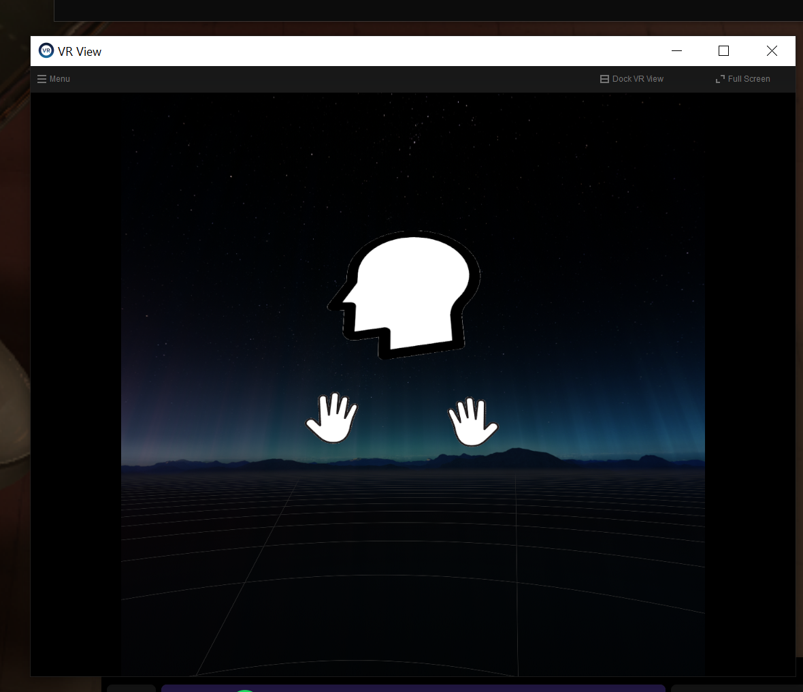

# SteamVR Overlay VRBuddy

A SteamVR app for displaying the position of your buddy's head and hands in your playspace. Useful for co-op VR games like flight simulators, tanks, etc. that don't render a mesh for your friends.



# Usage

Run `VRBuddy.exe` and follow the prompts. You can use Steam or direct IP to connect to your buddy.

# Development

```cli
dotnet restore
dotnet run
```

OpenVR SDK is downloaded from their GitHub: https://github.com/ValveSoftware/openvr

# Building

```cli
.\build.ps1
```

# Issues

- overlays sometime take 10 seconds+ to even render (might need to wait for something to initialize?)
- disconnecting headset causes a freeze

# Ideas

- make overlays face you
- use a SteamVR dashboard overlay to configure offsets/settings
- adjust scale and transparency of head and hands
- only render overlays when looking at them
